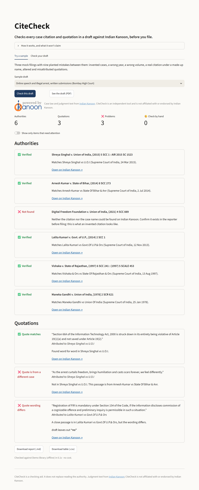

# CiteCheck

**Checks every case citation and quotation in a draft against Indian Kanoon, before you file.**

**[Try it live: citecheck.streamlit.app](https://citecheck.streamlit.app/?sample=c)** (sample filings, free, no sign-up)

Upload a written submission, petition or note of arguments. CiteCheck finds every authority and every quoted passage, checks each one against the judgment on Indian Kanoon, and tells you what it found, with a link to the source.



## Why

Drafting with AI tools has brought a new kind of error into court filings: judgments that don't exist, real citations attached to the wrong case, and quotations a judge never wrote. A cite-check before filing catches these, but doing it by hand takes time. CiteCheck does the mechanical part and leaves the judgment calls to the lawyer.

## What it checks

| Result | Meaning |
|---|---|
| ✅ **Verified** | The case exists, and Indian Kanoon lists it at the citation given. |
| ❌ **Wrong citation** | The case exists, but at a different volume, page or year. CiteCheck gives the correct citation. |
| ❌ **Citation belongs to another case** | The volume and page are real, but they belong to a different judgment. CiteCheck names it. |
| ❌ **Not found** | Neither the citation nor the case name exists on Indian Kanoon. This is what an invented citation looks like. |
| 🟡 **Case found, citation not confirmed** | The case exists, but Indian Kanoon doesn't list the reporter cited, so the volume and page can't be checked there. |
| 🟡 **Citation identified** | The draft gives a citation without a case name. CiteCheck says whose it is. |
| 🟡 **Needs a manual check** | For example, several cases share the name and none is listed at that citation. |
| ✅ **Quote matches** | The passage appears in the judgment word for word (capitals and punctuation aside). |
| ❌ **Quote wording differs** | A close passage exists, but words were changed, added or dropped. CiteCheck shows exactly which. |
| ❌ **Quote is from a different case** | The passage is real, but it comes from another authority cited in the draft. |
| ❌ **Quote not in the judgment** | No such passage in the judgment it is attributed to. |

Citation formats recognised: SCC (including Supp, Cri and L&S), SCC OnLine, AIR, SCR, INSC neutral citations, SCALE, JT, MANU, Cri LJ and DLT, written in either the usual form, `(2014) 8 SCC 273`, or Indian Kanoon's, `2014 (8) SCC 273`.

## Design choices

**No AI in the checking.** Citations are found by pattern matching, and every finding comes from comparison with the source text. The tool can't make up a case, and the same draft always gives the same result.

**It says only what the source supports.** Indian Kanoon lists Maneka Gandhi under its AIR and SCR citations but not its SCC citation. So for `(1978) 1 SCC 248`, CiteCheck says the case exists but the citation couldn't be confirmed. It does not call the citation wrong. A false "wrong citation" flag would cost a lawyer's trust faster than a missed one.

**Lawyers' quoting conventions are respected.** An ellipsis (`...`) or a bracketed insertion (`[the police]`) splits a quotation into pieces, and each piece is checked on its own. A single changed word fails the check: "only because" quoted as "merely because" is flagged, and so is "no preliminary inquiry is permissible" quoted without the "no".

**Cases that share a name are not guessed at.** If several judgments are called *State of Punjab v. Gurnam Singh* and none is listed at the citation given, CiteCheck asks for a manual check instead of picking one.

**Private, and cheap to run.** The draft is read in memory and never stored. Only citation strings and case names go to Indian Kanoon. Every API response is cached, and a daily call limit is a hard stop on spending.

**It credits its source, as Indian Kanoon's API terms require.** Every set of results opens with Indian Kanoon's "powered by" graphic, loaded from Indian Kanoon's own server at its natural size, and the downloads carry the same attribution. CiteCheck is an independent tool and is not affiliated with or endorsed by Indian Kanoon.

## Results on the test set

Three mock filings in `tests/drafts/` contain **9 planted errors**: two invented cases, a wrong year, a wrong volume, a real citation under a made-up name, an invented quotation, an altered quotation, a quotation with a word dropped, and a misattributed quotation. They also contain **16 correct items**. The answer key is in `tests/answer_key.json`.

| | Plain text | Word (.docx) | PDF |
|---|---|---|---|
| Items found | 25 / 25 | 25 / 25 | 25 / 25 |
| Planted errors caught | 9 / 9 | 9 / 9 | 9 / 9 |
| Correct items wrongly flagged | 0 / 16 | 0 / 16 | 0 / 16 |

**A caveat:** the test drafts were written alongside the code, so this shows the parts work together. It doesn't measure accuracy on drafts the tool has never seen. The next step is a blind test set, written by someone who hasn't read the code.

## Run it

```bash
python -m venv .venv
.venv\Scripts\activate          # Windows; on macOS/Linux: source .venv/bin/activate
pip install -r requirements.txt
streamlit run app.py
```

The **Try a sample** tab works straight away, offline and free. To check your own drafts, get an Indian Kanoon API token from [api.indiankanoon.org](https://api.indiankanoon.org/) (new accounts get ₹500 of credit) and set it before starting the app:

```bash
set IK_API_TOKEN=your-token                 # Windows; on macOS/Linux: export IK_API_TOKEN=your-token
set CITECHECK_DAILY_CALL_LIMIT=100          # optional hard stop, default 100 calls a day
```

From the command line:

```bash
python -m citecheck samples/draft_c_online_speech.pdf --demo     # offline demo library
python -m citecheck my_draft.docx --csv report.csv                # live
```

A typical draft uses 10 to 30 calls: a search costs ₹0.50 and a judgment fetch ₹0.20. Checking the same draft again is free.

## Test it

```bash
pip install -r requirements-dev.txt
pytest                                   # 50 tests
python scripts/score.py --ext .pdf       # the scorecard above
python scripts/score.py --live           # the same drafts against the live API (needs IK_API_TOKEN)
```

`tests/test_live_logic.py` replays how the live API behaves differently from the demo library: citation searches crowded with judgments that *cite* a case, several cases sharing a name, and the daily limit.

## Known limitations

- **Indian Kanoon's coverage.** It doesn't list every reporter for every case, so some correct citations can only be marked "couldn't confirm".
- **Indian Kanoon's text.** Its copies of older judgments contain OCR slips (Vishaka has "fro" for "for"). A correctly quoted passage that runs through one of these is flagged as altered. The link lets you see why at a glance.
- **Paragraph numbers aren't checked.** SCC's paragraph numbers don't match Indian Kanoon's, so CiteCheck shows where it found the passage but doesn't compare pinpoints.
- **Quotations need quotation marks.** Indented block quotes without quotation marks aren't picked up yet.
- **Scanned PDFs need OCR first.** CiteCheck reads the text layer.
- **The live mode is new.** The live API code is unit-tested against simulated responses, but it needs a first run with a real token to confirm how Indian Kanoon's search ranks citation queries.

## How it works

```
draft (PDF / DOCX / text)
  → extract.py     text, with PDF ligatures normalised
  → citations.py   citations, case names and parallel citations, by pattern
  → verify.py      for each authority: search the citation, then the name; compare
                   titles party by party; check the citations Indian Kanoon lists for the case
  → quotes.py      for each quotation: exact match, then a close match with a word-level diff
  → report.py      table, Markdown and CSV
kanoon.py          live API (cached, rate-limited) and the offline demo library, same interface
```

The demo library in `citecheck/data/demo_corpus/` holds six Supreme Court judgments, saved once from their public pages on Indian Kanoon by `scripts/build_demo_corpus.py`. Court judgments may be reproduced freely under Section 52(1)(q) of the Copyright Act, 1957.

## Licence

MIT. See [LICENSE](LICENSE).
